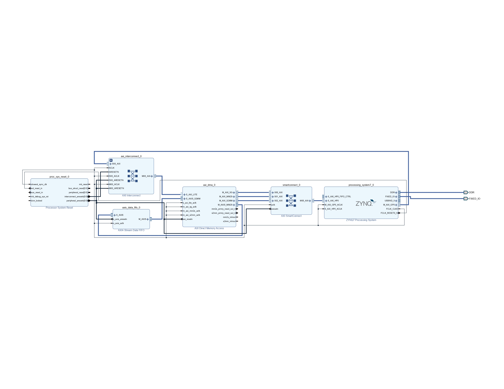
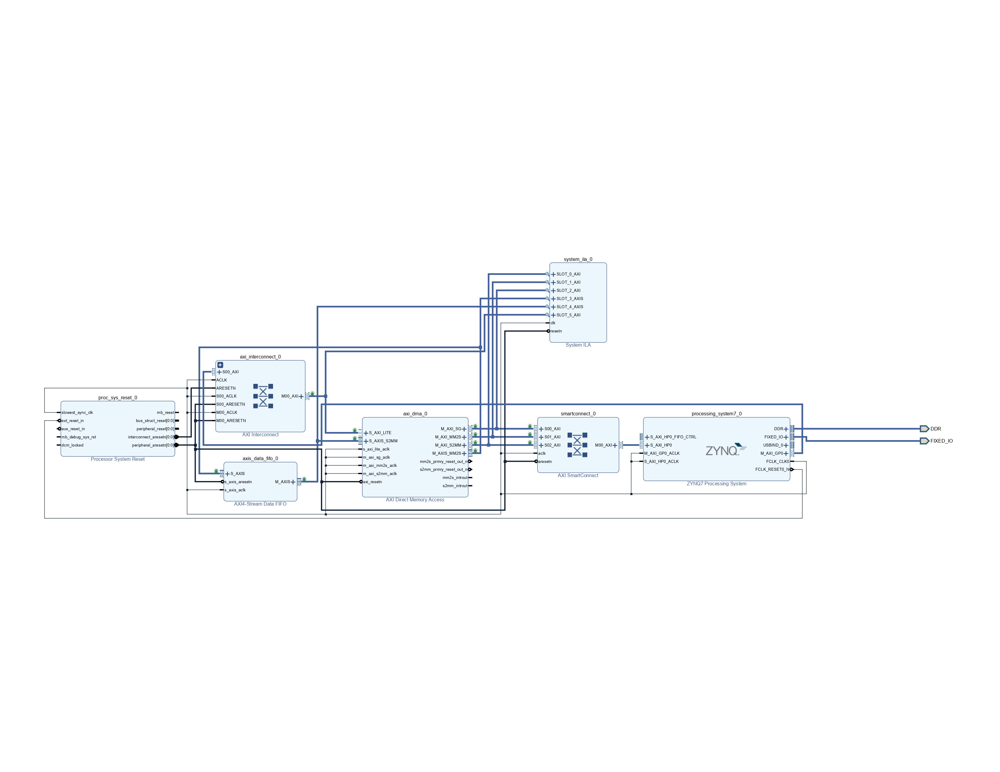
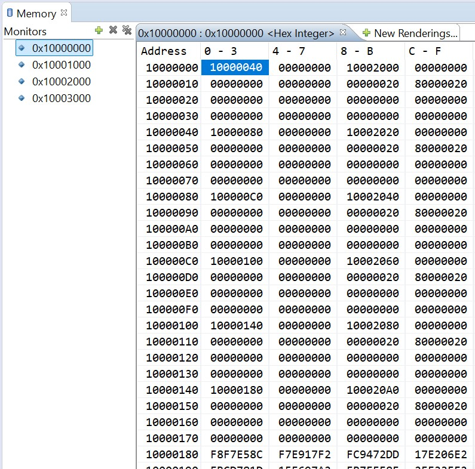
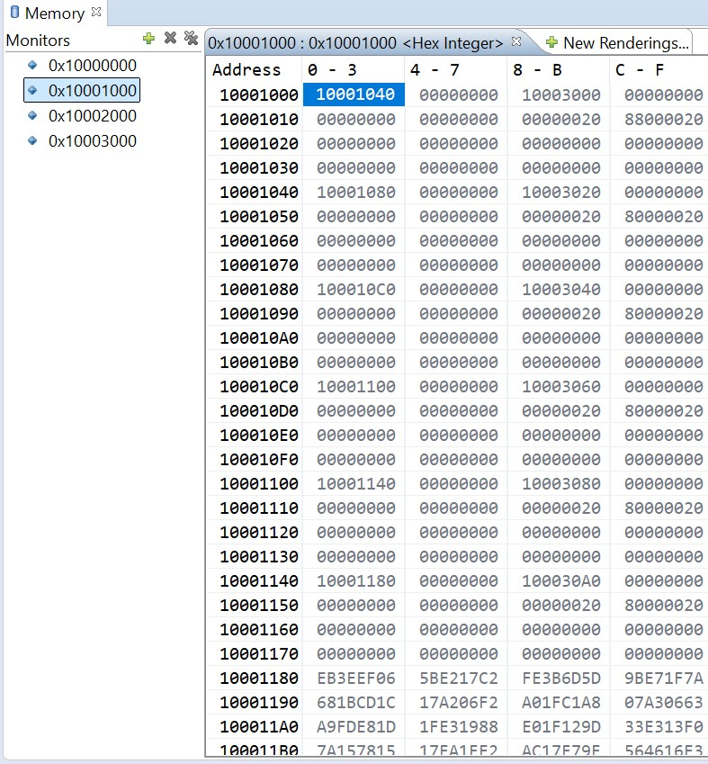
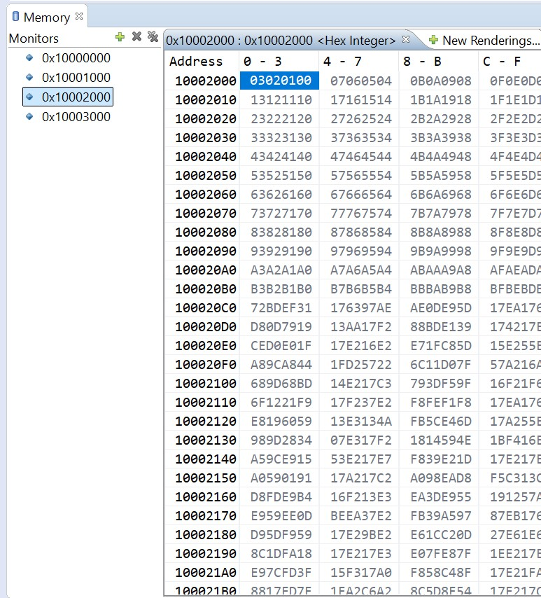
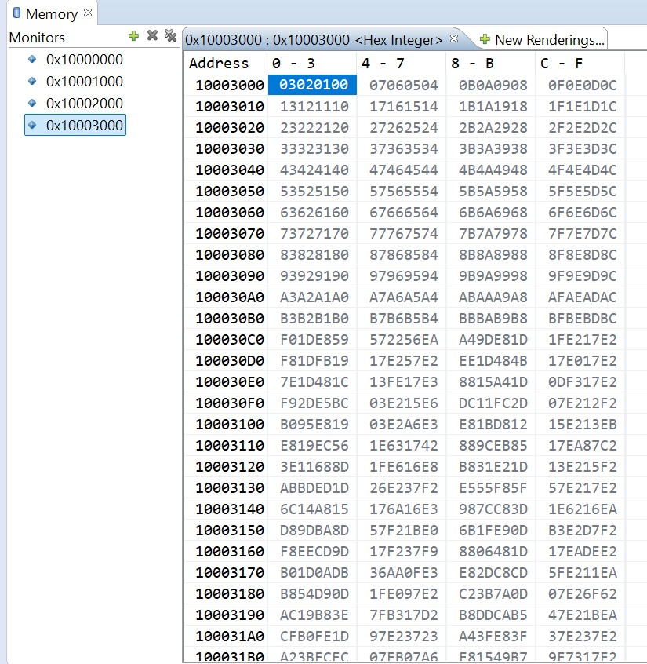

# Direct Memory Access via High Performance AXI Slave Port

## Summary

This project extends the [Simple Polling DMA](https://github.com/BekdoucheAmine/axi-dma-sp-cora-z7-07s) architecture by implementing *Scatter-Gather (SG)* mode. While the hardware transition involves adding an *AXI Master interface* for *Descriptor* fetching, the primary complexity shift occurs in the software layer. This guide focuses on the low-level register interfacing required to manage *Buffer Descriptors (BDs)* without relying on heavy abstractions.

## Table of Content

- Introduction
- Materials
- Methodology
    - Architecture Preview
    - Direct Register Interfacing
    - Driver Usage
- Results
    - Memory Inspection
    - Logic Inspection

## Introduction
TODO:

## Materials

1. [Cora Z7-07S (Zynq-7000)](https://digilent.com/shop/cora-z7-zynq-7000-single-core-for-arm-fpga-soc-development/)
2. [Xilinx Design Pack 2018.3 (Vivado+SDK)](https://www.xilinx.com/support/download/index.html/content/xilinx/en/downloadNav/vivado-design-tools/archive.html)

## Methodology

### Architecture Preview

To support *Scatter-Gather*, the *AXI DMA IP* requires the *SG interface* to be enabled. This creates a dedicated *AXI4 Master* port that allows the *DMA* engine to fetch transfer instructions (descriptors) directly from memory without *CPU* intervention for every packet.

**Note: The key difference from the Polling implementation is the addition of an AXI SmartConnect path between the DMA SG port and the Zynq HP Slave port.**

- Standard Scatter-Gather Architecture


- Debug configuration for ILA signal tapping


### Direct Register Interfacing

Interfacing directly with registers provides a deeper understanding of the *AXI DMA* state machine. In *SG* mode, the *CPU* no longer writes source/destination addresses to the *DMA* core directly; instead, it writes the address of the *First Descriptor*.

Here a small mapping of the used registers. For in depth analysis make sure to check the [product guide](https://www.amd.com/content/dam/xilinx/support/documents/ip_documentation/axi_dma/v7_1/pg021_axi_dma.pdf).

#### Register Map

**1. Scatter/Gather Mode Register Address Map**

| Address Space Offset | Name              | Description                                                   |
| -------------------- | ----------------- | ------------------------------------------------------------- |
| 00h                  | MM2S_DMACR        | MM2S DMA Control register                                     |
| 04h                  | MM2S_DMASR        | MM2S DMA Status register                                      |
| 08h                  | MM2S_CURDESC      | MM2S Current Descriptor Pointer. Lower 32 bits of the address |
| 10h                  | MM2S_TAILDESC     | MM2S Tail Descriptor Pointer. Lower 32 bits                   |
| 30h                  | S2MM_DMACR        | S2MM DMA Control register                                     |
| 34h                  | S2MM_DMASR        | S2MM DMA Status register                                      |
| 38h                  | S2MM_CURDESC      | S2MM Current Descriptor Pointer. Lower 32 address bits        |
| 40h                  | S2MM_TAILDESC     | S2MM Tail Descriptor Pointer. Lower 32 address bits           |

- Control Register

| 31 ⇔ 3 | 2     | 1        | 0        |
| ------- | ----- | -------- | -------- |
| /       | Reset | Reserved | Run/Stop |

- Status Register

| 31 ⇔ 2 | 1        | 0        |
| ------- | -------- | -------- |
| /       | Idle     | Halted   |

**2. Descriptor Fields (Non-multichannel Mode)**

Each *BD* is a 64-byte block in memory (though only the first 32 bytes are typically used in non-multichannel mode).

| Address Space Offset | Name                  | Description                              |
| ---------------------|-----------------------|------------------------------------------|
| 00h                  | NXTDESC               | Next Descriptor Pointer                  |
| 08h                  | BUFFER_ADDRESS        | Buffer Address                           |
| 18h                  | CONTROL               | Control (Number of Bytes)                |
| 1Ch                  | STATUS                | Status (Initialize to 0)                 |

#### Source Code

- **Implementation: Descriptor Chain Setup**

The following C snippet demonstrates how to manually construct a *Descriptor* chain in memory.

```c
// generate the two list for the sgdma
for (int i = 0; i<BD_NUM; i++)
{
    // increase bd pointers
    TxBDadd += BD_SIZE;
    RxBDadd += BD_SIZE;

    // tx block distributor registers
    TxBDPtr[((i*BD_SIZE)+ 0x00)/4] = TxBDadd; 				// next distributor lower pointer
    TxBDPtr[((i*BD_SIZE)+ 0x04)/4] = 0x00000000; 			// next distributor upper pointer
    TxBDPtr[((i*BD_SIZE)+ 0x08)/4] = TxBuffAdd; 			// lower buffer address
    TxBDPtr[((i*BD_SIZE)+ 0x0C)/4] = 0x00000000; 			// upper buffer address
    TxBDPtr[((i*BD_SIZE)+ 0x10)/4] = 0x00000000; 			// N/A
    TxBDPtr[((i*BD_SIZE)+ 0x14)/4] = 0x00000000; 			// N/A
    TxBDPtr[((i*BD_SIZE)+ 0x18)/4] = 0x00000000 + PKT_LEN; 	// control (number of bytes)
    TxBDPtr[((i*BD_SIZE)+ 0x1C)/4] = 0x00000000; 			// status (must be initialised to 0)
    TxBDPtr[((i*BD_SIZE)+ 0x20)/4] = 0x00000000; 			// usr app field 0
    TxBDPtr[((i*BD_SIZE)+ 0x24)/4] = 0x00000000; 			// usr app field 1
    TxBDPtr[((i*BD_SIZE)+ 0x28)/4] = 0x00000000; 			// usr app field 2
    TxBDPtr[((i*BD_SIZE)+ 0x2C)/4] = 0x00000000; 			// usr app field 3
    TxBDPtr[((i*BD_SIZE)+ 0x30)/4] = 0x00000000; 			// usr app field 4
    TxBDPtr[((i*BD_SIZE)+ 0x34)/4] = 0x00000000; 			// not used
    TxBDPtr[((i*BD_SIZE)+ 0x38)/4] = 0x00000000; 			// not used
    TxBDPtr[((i*BD_SIZE)+ 0x3C)/4] = 0x00000000; 			// not used

    // rx block distributor registers
    RxBDPtr[((i*BD_SIZE)+ 0x00)/4] = RxBDadd; 				// next descriptor pointer
    RxBDPtr[((i*BD_SIZE)+ 0x04)/4] = 0x00000000; 			// N/A
    ...
    RxBDPtr[((i*BD_SIZE)+ 0x18)/4] = 0x00000000 + PKT_LEN; 	// control (number of bytes)
    ...
    RxBDPtr[((i*BD_SIZE)+ 0x3C)/4] = 0x00000000; 			// not used

    // increase buffers
    TxBuffAdd += PKT_LEN;
    RxBuffAdd += PKT_LEN;
}
```
- **Execution Sequence**

The order of operations is critical. Writing to the *Tail Descriptor* register is the "Go" signal for the *DMA* hardware.

1. **Reset:** Set Bit 2 in *DMACR* for both channels.
2. **Assign Head:** Write *CURDESC* with the address of the first *BD*.
3. **Start:** Set Bit 0 (Run/Stop) in *DMACR*.
4. **Trigger:** Write *TAILDESC* with the address of the last *BD* in your chain.

**Note: Always start the Rx channel before the Tx channel to prevent data loss or AXI-Stream backpressure.**

```c
// axi dma scatter-gather registers
DMA[0x00/4] = 0x04; // mm2s control register (generate reset)
DMA[0x30/4] = 0x04; // s2mm control register (generate reset)

DMA[0x08/4] = TX_BD_SPACE_BASE; // mm2s current descriptor pointer register
DMA[0x38/4] = RX_BD_SPACE_BASE; // s2mm current descriptor pointer register

tmp0 = DMA[0x00/4]; // get mm2s control register value
DMA[0x00/4] = tmp0 | 0x00000001; // start mm2s channel
tmp1 = DMA[0x30/4]; // get s2mm control register value
DMA[0x30/4] = tmp1 | 0x00000001; // start s2mm channel

// start with Rx before the Tx to make sure the Rx is ready to receive the data when the Tx starts sending it
DMA[0x40/4] = RX_BD_SPACE_BASE + (BD_SIZE * BD_NUM) - BD_SIZE; // s2mm tail descriptor pointer register (point to the last descriptor in the list)
DMA[0x10/4] = TX_BD_SPACE_BASE + (BD_SIZE * BD_NUM) - BD_SIZE; // mm2s tail descriptor pointer register (point to the last descriptor in the list)
```

### Driver Usage
TODO:

## Results
TODO: Add driver comparison side by side

### Memory Inspection

#### Bloc Descriptors

Tx BD                                       | Rx BD                 
 ------------------------------------------ | ------------------------------------------- 
 |  

By inspecting the *DDR memory space* via the *SDK Debugger*, we can verify the *BD* updates.

- **TX/RX BDs:** Verified the 0x40 offset between descriptors.

- **Status Update:** After execution, the *STATUS* field (Offset 0x1C) of the *BDs* should show the "Completed" bit set by the hardware.

#### Data Buffers

Tx Buffer                                  | Rx Buffer                 
 ----------------------------------------- | ------------------------------------------ 
  |  

### Logic Inspection
TODO: